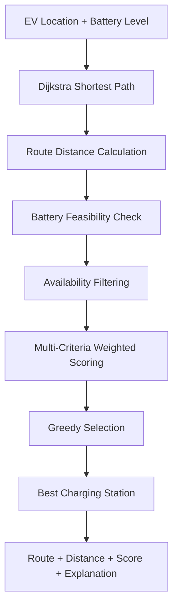
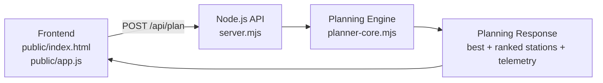

<div align="center">

# ⚡ ChargePath

### EV Route & Charging Intelligence

**Choose the smartest feasible charging stop—not simply the nearest one.**

ChargePath is an explainable EV charging-station planner that combines shortest-path routing, battery safety constraints, station availability, charging-time preferences, and weighted decision scoring into one fast recommendation.

<p>
  <a href="https://github.com/19anveshh/ChargePath">GitHub Repository</a>
  ·
  <a href="https://charge-path.vercel.app">Live Demo</a>
</p>

[](#algorithms)
[](#tech-stack)
[](#tech-stack)
[](#limitations)

</div>

---

## Problem

The nearest charging station is not always the right charging station.

A station can be geographically close but still be a poor or unsafe choice because it may be:

- Beyond the vehicle's available range after reserving a safety buffer
- Outside the driver's comfortable travel distance
- Unavailable or unsuitable for a fast-charging preference
- Slower than the driver's preferred charging time
- Slightly farther away but materially better across the overall decision criteria

Choosing by distance alone ignores the constraints and trade-offs that matter during an EV trip. ChargePath treats the decision as a constrained routing and ranking problem.

## Solution

ChargePath evaluates each simulated charging station in two stages:

1. **Feasibility:** Calculate the shortest route, then remove stations that fail the battery-range, comfortable-distance, or availability requirements.
2. **Optimization:** Score the remaining stations across distance, battery safety, charging time, and availability, then select the highest-scoring feasible option.

The result is a recommendation that includes the selected station, route distance, estimated travel time, arrival battery level, score breakdown, rank, and an explanation of why it won.

## How It Works



## Algorithms

### Dijkstra shortest path

The planner represents the simulated road network as a bidirectional weighted graph. Dijkstra's algorithm calculates the shortest distance and travel time from `origin` to every station node. The response also includes the reconstructed node path and execution telemetry.

### Battery feasibility filtering

The planner reserves 10% of the vehicle battery as a safety buffer. Available range is calculated as:

```text
availableRange = (batteryLevel / 100) × 40 km × (1 - 0.10)
```

A station must be within both the calculated available range and the user's comfortable distance. Battery feasibility is a hard gate: a station that fails it cannot win through scoring.

### Availability filtering

The availability selector supports three modes:

- `available`: only stations currently marked available
- `fast`: available stations that also support fast charging
- `all`: include all stations, including busy stations

### Weighted scoring

Every station receives normalized component scores before the final score is calculated. The current default scoring model is:

| Criterion | Weight | Meaning |
| --- | ---: | --- |
| Distance | **35%** | Preference for shorter routes relative to the station set |
| Battery Safety | **25%** | Remaining range margin after reaching the station |
| Charging Time | **20%** | Fit between station charge time and the user's preference |
| Availability | **20%** | Current open-stall availability |

```text
score = 0.35 × distance
      + 0.25 × batterySafety
      + 0.20 × chargingTime
      + 0.20 × availability
```

The API also accepts optional custom weights. The planner clamps negative values to zero and normalizes the supplied weights before ranking.

### Greedy selection

After feasibility filtering, eligible stations are sorted by descending final score. Ties are resolved by shortest distance and then shortest charging time. The first station becomes `best`, and the remaining candidates receive ranks.

## Key Features

- Explainable charging-station recommendations with score breakdowns
- Dijkstra shortest-path calculation over a simulated road graph
- 10% battery reserve and comfortable-distance feasibility gates
- Availability modes for available, all, and fast-charging stations
- Weighted multi-criteria ranking with configurable API weights
- Interactive route map, station alternatives, and route telemetry
- Scenario presets for standard, low-battery, long-haul, and fast-charger planning
- Reconstructed Dijkstra path and algorithm telemetry in the UI
- Turn-by-turn navigation manifest for the selected station
- Client-side Dijkstra fallback when the API is unavailable

## Tech Stack

- **Frontend:** HTML, CSS, and browser JavaScript with no frontend framework
- **Backend:** Node.js using native HTTP and ES modules
- **Planning engine:** `planner-core.mjs`
- **API:** JSON endpoints for health checks and trip planning
- **Deployment:** Vercel-compatible Node.js server entrypoint and Dockerfile
- **Data:** Simulated road graph and charging-station catalog for the hackathon prototype

## System Architecture



The same planning logic is used by the local Node.js server and the API function entrypoints. Static frontend assets are served from `public/`.

## API

### `GET /api/health`

Returns the service health payload.

```bash
curl http://localhost:3000/api/health
```

Response:

```json
{
  "ok": true,
  "service": "chargepath-planner-api"
}
```

### `POST /api/plan`

Plans a trip and returns the eligible stations, ranked candidates, selected station, normalized weights, and algorithm telemetry.

```bash
curl -X POST http://localhost:3000/api/plan \
  -H "Content-Type: application/json" \
  -d '{
    "batteryLevel": 64,
    "comfortableDistance": 18,
    "preferredChargingTime": 35,
    "availability": "available"
  }'
```

#### Request body

| Field | Type | Default | Description |
| --- | --- | ---: | --- |
| `batteryLevel` | number | `64` | Current battery percentage; clamped to `0–100` |
| `comfortableDistance` | number | `18` | Maximum comfortable travel distance in km; minimum `1` |
| `preferredChargingTime` | number | `35` | Preferred charging time in minutes; minimum `1` |
| `availability` | string | `available` | One of `available`, `fast`, or `all` |
| `weights` | object | default weights | Optional values for `distance`, `batterySafety`, `chargingTime`, and `availability`; normalized by the planner |

The planner also accepts the legacy aliases `battery`, `distance`, and `chargeTime` for the corresponding primary fields.

#### Response shape

The response contains these top-level fields:

| Field | Description |
| --- | --- |
| `input` | Normalized trip inputs used by the planner |
| `weights` | Normalized scoring weights |
| `availableRange` | Battery-safe range in km after the 10% reserve |
| `algorithm` | Route method, selection method, visited nodes, considered edges, and complexity |
| `best` | Highest-scoring eligible station, or `null` when no station is eligible |
| `ranked` | Eligible station objects sorted and assigned a rank |
| `stations` | All catalog stations with scores, eligibility, status, path, and rank information |

Each station object includes fields such as `id`, `name`, `node`, `shortAddress`, `chargeTime`, `open`, `total`, `available`, `fast`, `state`, `distance`, `travelMin`, `score`, `scoreBreakdown`, `eligible`, `status`, `path`, `arrivalBattery`, and `rank`.

Example algorithm metadata returned by the current planner:

```json
{
  "algorithm": {
    "route": "Dijkstra",
    "selection": "Greedy",
    "visitedNodes": 7,
    "edgesConsidered": 12,
    "complexity": "O(V log V + E)"
  }
}
```

Malformed JSON or an invalid planning request returns HTTP `400` with an error payload. Unknown API routes return HTTP `404`.

## Getting Started

### Prerequisites

- Node.js with ES module support
- npm

### Run locally

```bash
git clone https://github.com/19anveshh/ChargePath.git
cd ChargePath
npm install
npm start
```

Open [http://localhost:3000](http://localhost:3000) in a browser.

The `start` script in `package.json` runs `node server.mjs`. The server uses `PORT` when supplied and defaults to `3000`.

## Project Structure

```text
ChargePath/
├── api/
│   ├── health.mjs           # Health endpoint function
│   └── plan.mjs             # Planning endpoint function
├── public/
│   ├── index.html           # Planner interface
│   ├── app.js               # UI state, interactions, and API integration
│   ├── styles.css           # Visual system and responsive layout
│   ├── motion.js            # UI motion helpers
│   ├── chargepath-mark.svg  # Favicon/brand mark
│   └── manus-routes.json    # Frontend route metadata
├── planner-core.mjs         # Graph, Dijkstra, filters, scoring, and ranking
├── server.mjs               # Node.js server for frontend and API routes
├── dev-server.mjs           # Local-compatible HTTP server implementation
├── Dockerfile               # Node 22 Alpine container definition
├── package.json              # Project metadata and start script
├── app.config.ts            # App configuration
├── plan.md                  # Planning notes
├── frontend-build-plan.md   # Frontend build notes
└── TODO.md                  # Remaining project notes
```

## Example Decision

For the default request:

```json
{
  "batteryLevel": 64,
  "comfortableDistance": 18,
  "preferredChargingTime": 35,
  "availability": "available"
}
```

the battery-safe range is `23.04 km` after the 10% reserve. The planner produces a decision like this:

| Station | Route distance | Eligibility | Result |
| --- | ---: | --- | --- |
| Solar Plaza Hub | `9.8 km` | Eligible | Rank 1; score `82.65` |
| Riverfront Charge | `12.4 km` | Eligible | Rank 2; score `73.10` |
| North Loop Energy | `16.8 km` | Excluded | Busy under the `available` filter |
| Parkside Volt | `24.6 km` | Excluded | Outside both the `23.04 km` safe range and `18 km` comfort limit |

The example shows why feasibility is applied before optimization: Parkside Volt cannot win by having a shorter charging time because it is not safely reachable under the current constraints.

## Why This Approach?

- **Dijkstra handles routing:** It calculates shortest paths and travel times through the weighted road graph.
- **Constraints handle safety:** Battery reserve and comfortable-distance limits remove infeasible stations before scoring.
- **Weighted scoring handles multiple objectives:** Distance, safety, charging time, and availability can all influence the recommendation.
- **Greedy selection makes the decision fast:** Once the feasible set is scored, the highest-ranked current option is immediately available with an explainable breakdown.

## Hackathon Value

ChargePath demonstrates a practical algorithmic decision system rather than a nearest-location lookup:

- **Explainable decisions:** The UI exposes route, score, ranking, and the factors behind the recommendation.
- **Safety-aware selection:** A strict battery reserve prevents infeasible stations from being recommended.
- **Multiple decision criteria:** Drivers can balance distance, battery margin, charging time, and availability.
- **Algorithmic approach:** Dijkstra and greedy ranking provide a clear, deterministic decision pipeline.
- **Fast recommendation:** The small graph and focused scoring model produce an immediate result suitable for interactive planning.

## Limitations

This is a hackathon prototype using simulated road and charging-station data. It does not currently claim:

- Live GPS or map positioning
- Live traffic conditions
- Live charging-station occupancy
- Live charging prices
- Real vehicle telemetry

The station catalog, road graph, availability, travel times, and charging characteristics are modeled locally for demonstration and algorithm evaluation.

## Future Scope

- Real map and GPS integration
- Live charging-station availability
- Traffic-aware routing
- Vehicle-specific energy-consumption models
- Charging-cost optimization
- Multi-stop charging planning
- Navigation integration

## Demo

- **Live Demo:** https://charge-path.vercel.app
- **GitHub:** https://github.com/19anveshh/ChargePath

## Author

Built by [19anveshh](https://github.com/19anveshh).

---

<div align="center">

**ChargePath — Dijkstra shortest paths, safety constraints, and explainable EV charging decisions.**

</div>
